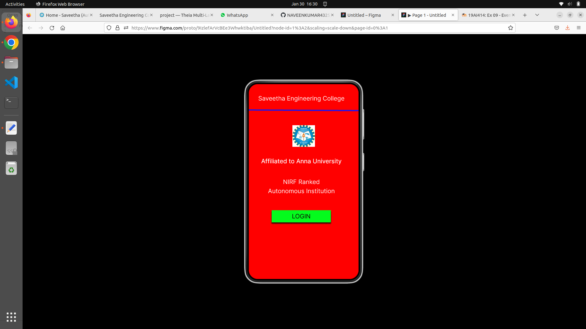
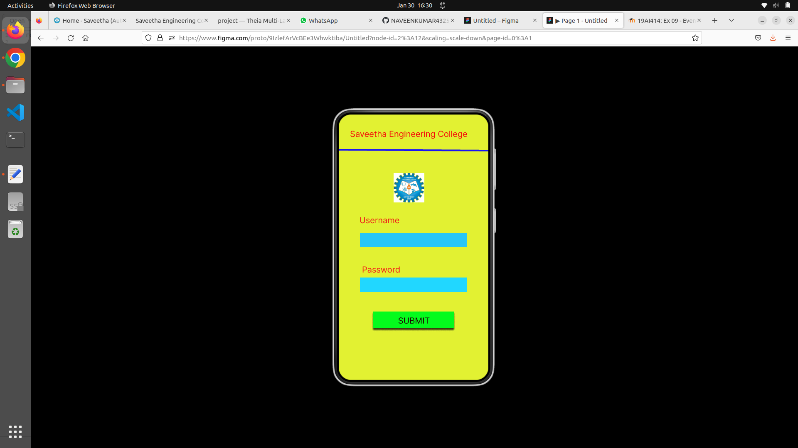
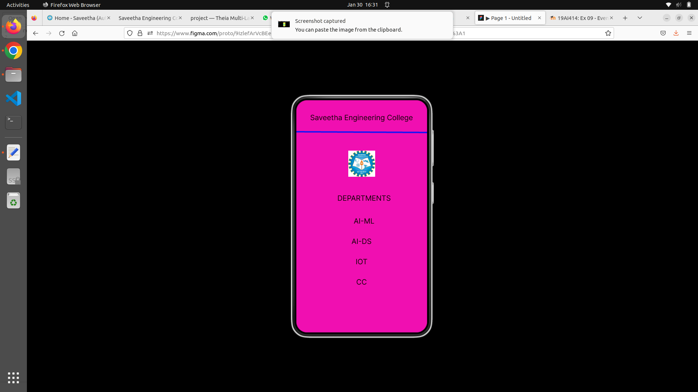

# Event Registration Web Application

## AIM:
To design, develop and deploy a web application for event registration.

## DESIGN STEPS:

### Step 1:
Create a new frame.

### Step 2:
Select any one present size of your choice.

### Step 3:
Select the shapes you need

### Step 4:
Import images as needed.

### Step 5:
Create pages based on your need and link them.

### Step 6:
Validate the HTML and CSS code.

### Step 7;
Publish the website in the given URL.

## DESIGN TOOL:
Figma

## Code:
```
* Home Page */
position: relative;
width: 360px;
height: 641px;
background: #FF0000;

/* Login Page */
position: relative;
width: 360px;
height: 641px;
background: #E2F132;

/* Saveetha Engineering College */
position: absolute;
width: 327px;
height: 41px;
left: 16px;
top: 36px;
font-family: 'Inter';
font-style: normal;
font-weight: 400;
font-size: 20px;
line-height: 24px;
text-align: center;
color: #0E0101;

/* DEPARTMENTS */
position: absolute;
width: 327px;
height: 41px;
left: 23px;
top: 258px;
font-family: 'Inter';
font-style: normal;
font-weight: 400;
font-size: 20px;
line-height: 24px;
text-align: center;
color: #0E0101;

/* AI-ML */
position: absolute;
width: 327px;
height: 41px;
left: 23px;
top: 321px;
font-family: 'Inter';
font-style: normal;
font-weight: 400;
font-size: 20px;
line-height: 24px;
text-align: center;
color: #0E0101;

/* AI-DS */
position: absolute;
width: 327px;
height: 41px;
left: 16px;
top: 377px;
font-family: 'Inter';
font-style: normal;
font-weight: 400;
font-size: 20px;
line-height: 24px;
text-align: center;
color: #0E0101;

/* IOT */
position: absolute;
width: 327px;
height: 41px;
left: 16px;
top: 433px;
font-family: 'Inter';
font-style: normal;
font-weight: 400;
font-size: 20px;
line-height: 24px;
text-align: center;
color: #0E0101;

/* CC */
position: absolute;
width: 327px;
height: 41px;
left: 16px;
top: 489px;
font-family: 'Inter';
font-style: normal;
font-weight: 400;
font-size: 20px;
line-height: 24px;
text-align: center;
color: #0E0101;

/* Line 3 */
position: absolute;
width: 360.01px;
height: 1px;
left: 0px;
top: 89px;
border: 4px solid #1814F7;
transform: rotate(0.32deg);

/* index 3 */
position: absolute;
width: 74px;
height: 72px;
left: 143px;
top: 139px;
background: url(index.jpg);
```
## OUTPUT:




## Result:
The program to design, develop and deploy a web application for event registration is completed successfully.
